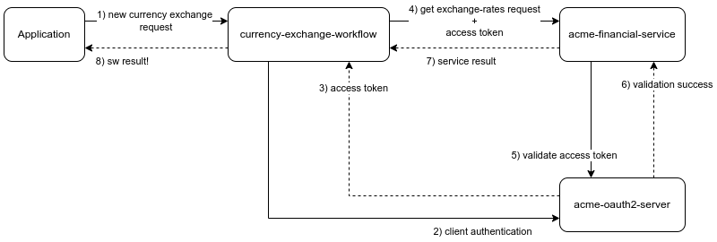
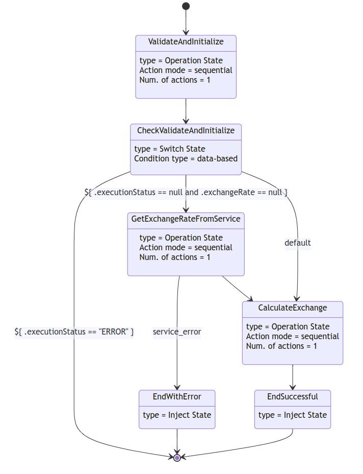

# Kogito Serverless Workflow - Oauth2 Orchestration Example

This example shows how to configure a Serverless Workflow that orchestrate the interaction with an Oauth2 secured REST service.

Imagine that you have set of applications that must resolve currency exchange calculations as part of their regular operations. 
For that, you need an accurate source of information to get the different exchange rates.

Fortunately, your company has a commercial agreement with Acme Financial Services, and those rates can be queried using their Oauth2 secured services.
As a confidential client, you were granted with proper credentials to access their services as part of the agreement.

However, you don't want to expose that services to your applications, instead you want to provide a Serverless Workflow that resolves:

* The orchestration with Acme's services and the currency exchange calculation.
* The authentication requirements to access that service.
* Provide a custom service that your applications can rely on (won't change over the time), and avoid vendor lock-in problems with Acme.
* Optimize the interactions with the external services, implement validations, etc.

## The currency-exchange-workflow

The `currency-exchange-workflow` implements the requirements stated above.

### Architecture

In the following you can see a simplified view of the architecture of this example.



1. The application sends a request to calculate the currency exchange.
2. The flow executes the necessary validations and determine if the `acme-financial-service` must be queried.
3. Case yes, an authentication request is sent to `acme-oauth2-server` using the credentials provided by Acme.
4. An access token is returned by the `acme-oauth2-server`.
5. A request is sent to the `acme-financial-service` and the access token is sent as part of the call.
6. The access token is validated.
7. A successful validation enables the query execution, results are sent o the flow.
8. The 'currency-exchange-workflow` receives the exchange rate, perform the calculations, and returns the result.


> **NOTE:** The steps related to the Oauth2 server interaction might vary depending on the authorization flow to use. 
However, all these interactions are transparent to the serverless workflow, and you only have to configure proper OidcClient according to that flow and the target Oauth2 server. TODO, link?  

### Workflow diagram

The figure below shows the `currency-exchange-workflow` diagram: 




10. 

## Example UI

To run the example, a simple UI is provided and can be used to emulate both the query formulation and resolution. Note that two different applications are being emulated.

**Please read the following files and follow the required steps to start all the required components.**

1) [query-answer-service/README.md](query-answer-service/README.md)
2) [query-service/README.md](query-service/README.md)

When all the components and services are started, follow these steps to formulate and resolve queries using the UI.

> **NOTE:** All the query formulation and resolution cycle can also be invoked by using the services respective endpoints.

### Formulate a query

1) Open a browser window with the following url: http://localhost:8080.

   The application that represents the Query and Answer service will be opened.

2) Create your query and send it.


3) After creating the query, you will see all the queries in the knowledge database.


### Resolve a query

1) Open a browser window with the following url: http://localhost:8283

   The application that represents the external service that solves the queries will be opened.


2) Select and resolve a query.


### See the results

1) Go back to the Query Answer Service application http://localhost:8080 and see the results.


## Running on Knative

Alternatively, you can run this whole example on Knative. Instead of using Kafka, we are going to leverage the Knative Eventing Broker to abstract the broker implementation for us.

In this example we use a regular, in-memory, broker. Feel free to adapt the example to use other brokers implementations.

### Preparing your environment

1. Install [minikube](https://minikube.sigs.k8s.io/docs/start/)
2. Install Knative using the [quickstarts](https://knative.dev/docs/getting-started/) since a DNS will be configured for you.
3. Install the [Knative Kogito Source](https://github.com/knative-sandbox/eventing-kogito#installation).
4. Run `eval $(minikube -p minikube docker-env --profile knative)` to build the images in your internal Minikube registry.
5. Run `mvn clean install -Pknative`. All resources needed to run the example will be generated for you.

Deploy the services with the following command:

```shell
# the namespace name is very important. If you decide to change the namespace, please be update the query-answer-service Knative properties.
$ kubectl create ns qos-showcase
# install the query-answer-service and the Postgres database
$ kubectl apply -f query-answer-service/target/kubernetes/knative.yml -n qos-showcase
$ kubectl apply -f query-answer-service/target/kubernetes/kogito.yml -n qos-showcase
# install the query-service 
$ kubectl apply -f query-service/target/kubernetes/knative.yml -n qos-showcase
```

And you are done! To play around with the example UI, first discover the URLs managed by Knative:

```shell
$ kubectl get ksvc -n qas-showcase

NAME                   URL                                                           LATESTCREATED                LATESTREADY                  READY   REASON
query-answer-service   http://query-answer-service.qas-showcase.127.0.0.1.sslip.io   query-answer-service-00004   query-answer-service-00004   True
query-service          http://query-service.qas-showcase.127.0.0.1.sslip.io          query-service-00002          query-service-00002          True
```

The `URL` column has the applications' endpoint.

Expose the URLs in your local environment. In a separated terminal, run:

```shell
# you might be asked for your admin password
$ minikube tunnel --profile knative
```

Open the URLs in your browser and try playing with your services scaling to 0.

Note that even when the pod is scaled back after a short period of time, your data remains there. That's the power of a stateful Kogito Serverless Workflow!
